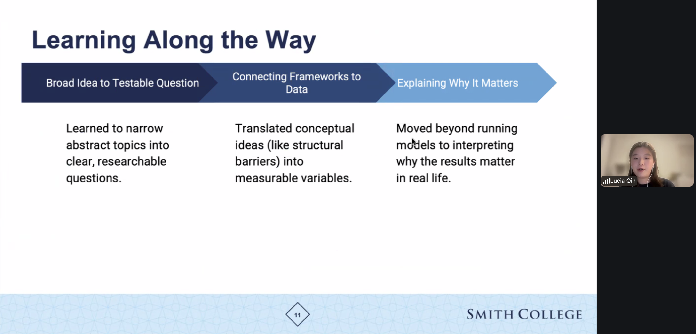

**Please help us reach out to other alumnae by having them contact Ben (<bbaumer@smith.edu>)!**

## Program Updates

-   **Lucia Qin '26** shared her learning experience as a student research assistant in the invited panel "Teamwork Makes the Dream Work: Leveraging Different Approaches to Learn from Data" at the [Women in Statistics and Data Science Conference (WSDS) 2025](https://ww2.amstat.org/meetings/wsds/2025/) virtually.

### Previous Updates

- [2025](sds_newsletter_2025.qmd)
- [2024](sds_newsletter_2024.qmd)
- [2023](sds_newsletter_2023.qmd)
- [2022](sds_newsletter_2022.qmd)
- [2021](sds_newsletter_2021.qmd)
- [2020](sds_newsletter_2020.qmd)
- [2019](sds_newsletter_2019.qmd)
- [2018](sds_newsletter_2018.qmd)
- [2017](sds_newsletter_2017.qmd)
- [2016](sds_newsletter_2016.qmd)

## Faculty Updates

#### [Ben Baumer](https://beanumber.github.io/)

I'm working on a couple of papers with recent alums:

- [Everyone Watches Women’s Basketball: Attendance and Fan Engagement in the WNBA](https://g-eastwood.github.io/wnbaattendance/) with **Gabriela Eastwood '26**. This paper stems from a research paper that Gabriela wrote for my SDS 355 Sports Analytics class in the fall. 
- [Reward systems in sports: Who’s the fairest of them all?](https://beanumber.github.io/fairness/) with **Sarah Susnea '25**. This is ongoing work that started during our Pedagogical Partnership for the SDS capstone. 

I'm also working on a couple of papers in the data science education space about first and [second courses in data science](https://beanumber.github.io/datascience2/). 

I'm gearing up for another 1.5 years as SDS chair, and looking forward to [JSM in Boston](#whats-next).
Hope to see you there!

In other news, I coached Alice's 12U softball team and we [won the Massachusetts District 2 championship](https://gazettenet.com/2026/06/11/sports-briefs-northampton-12u-softball-claims-2026-massachusetts-district-2-little-league-title/)!!

#### [Gillian Beltz-Mohrmann](https://gbeltzmo.github.io/)

#### [Shiya Cao](https://scao53.github.io/)

Year 4 at Smith was a productive year. I am grateful for my pre-tenure sabbatical in Fall 2025. The focus of my sabbatical was taking up the Visiting Fellow position at the Yang-Tan Institute (YTI) on Employment and Disability in the School of Industrial and Labor Relations at Cornell University. During this fellowship, I worked on and submitted one peer-reviewed journal paper, delivered an invited lecture, built collaborative research opportunities with YTI faculty. Furthermore, the sabbatical allowed me to make progress on several other research projects: 

- published two peer-reviewed journal papers co-authored with students: 

    -   [Educational Opportunities of Participatory GIS for Accessibility on a College Campus](https://www-tandfonline-com.libproxy.smith.edu/doi/full/10.1080/03098265.2025.2549304) with Heather Rosenfeld and **Sarah Susnea ’25**
    -   [Examining the Intersectional and Structural Issues of Routine Healthcare Utilization and Access Inequities for LGB People with Chronic Diseases](https://www.mdpi.com/1660-4601/22/12/1830) with **Mehreen Merza ’25**, **Sophia Silovsky ’24**, **Nicole Tresvalles ’24**, **Lucia Qin ’26**, and **Sarah Susnea ’25**. This paper stems from a project paper **Mehreen Merza ’25**, **Sophia Silovsky ’24**, and **Nicole Tresvalles ’24** wrote for my *SDS 300: Disability Inclusion and Data Analytics* in Fall 2023

- published one peer-reviewed American Statistical Association (ASA) *Chance* magazine paper on [A Review of Research and Practices on Teaching Data Visualizations for Blind and Visually Impaired Students](https://www-tandfonline-com.libproxy.smith.edu/doi/full/10.1080/09332480.2025.2560278)
- applied for the [American Council of Learned Societies (ACLS)](https://www.acls.org/) Digital Justice Seed Grants with Heather Rosenfeld for our comprehensive and participatory campus accessibility maps project. Our application received positive feedback during the first round of review and advanced to the second round of evaluation, although not funded

The latest news on my research is that the data package `tripaccess 0.1.0: American Travel Behavior and Access Datasets` is now available on CRAN. I worked with **Amber Zhang ’27** and **Anna Zhao ’27** on this data package this summer. Please check out [the package site](https://scao53.github.io/tripaccess/) for more information!

I was also excited to be back in Spring 2026 (to be honest, a little overwhelmed for the first half of the semester as I adjusted to being back) to teach *SDS 192: Introduction to Data Science* and *SDS 300: Disability Inclusion and Data Analytics*. During the semester, I participated in the ASA Justice, Equity, Diversity, and Inclusion Outreach Group-Reading/Working Group (this group provided valuable feedback on my data package--thanks for that!). The materials we read in this group made me think more deeply about my pedagogy while I was teaching and learning alongside my students. It turned out to be a rewarding semester. Now I am really looking forward to next semester, teaching SDS 192 and *SDS 270: Programming for Data Science in R* and working with my student pedagogical partner **Tanisha Chetty ’27** on issues around AI in SDS 270.

In 2026, I started running and swimming regularly (absolute beginner level)--adding more cardio to my workouts!

#### [Dusty Christensen](https://www.smith.edu/people/dusty-christensen)

#### [Kaitlyn Cook](https://www.smith.edu/people/kaitlyn-cook)

#### [Randi Garcia](https://www.randilgarcia.com/)

#### [Will Hopper](https://www.smith.edu/people/will-hopper)

#### [Albert Y. Kim](https://www.smith.edu/people/albert-young-sun-kim)

#### [Sara Kirshbaum](https://www.smith.edu/people/sara-kirshbaum)

#### [Katherine M. Kinnaird](https://katherinemkinnaird.net/)

#### [Rebecca Kurtz-Garcia](https://www.smith.edu/people/rebecca-kurtz-garcia)

#### [Ab Mosca '14](https://www.smith.edu/people/ab-mosca)

#### [Lindsay Poirier](https://lindsaypoirier.github.io/)

#### [Nikko Stevens](https://www.smith.edu/people/nikko-stevens)

#### [Kementari Whitcher](https://www.smith.edu/people/kementari-whitcher)

## Alumni Updates

-   Alumni updates will be added HERE

## What's next?

### Joint Statistical Meetings

Many of us will be at the [2026 Joint Statistical Meetings](https://ww2.amstat.org/meetings/jsm/2026/index.cfm) during the first week of August in **BOSTON**!.

Don't miss these events featuring Smithies and current faculty!

Join us for the **Smith JSM get together**:

- [Boqueria Seaport](https://boqueriarestaurant.com/location/bos-seaport/)  
  25 Thomson Pl  
  Boston, MA 02210  
  Monday, August 3rd  
  7 - 8:30 p  

We hope to see you there!
