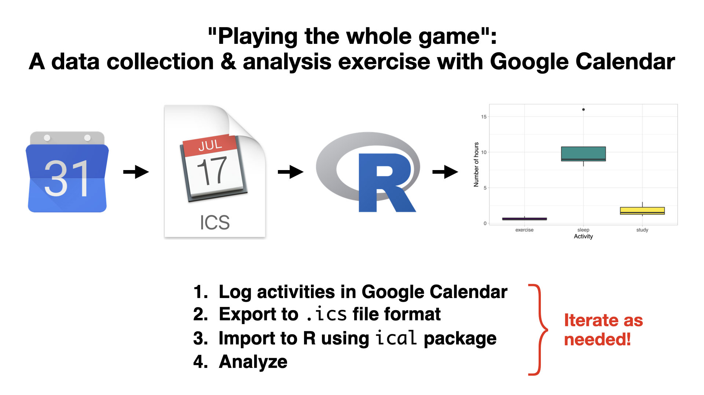

Resources for instructors for [Albert Y. Kim](http://rudeboybert.rbind.io/){target="_blank"} & [Johanna Hardin's](https://research.pomona.edu/johardin/){target="_blank"} *"Playing the whole game": A data collection and analysis exercise with Google Calendar* [Journal of Statistics Education paper](https://doi.org/10.1080/10691898.2020.1799728){target="_blank"}.

```{r, echo = FALSE, out.width = "80%"}

```


# Learning Goals

The learning goals of this assignment relate to:

* Data Collection
    1. Experience creating measurable data observations (e.g., how is "one day" measured, or what defines "studying").
    2.  Address data collection constraints due to limits in technological capacity and human behavior.
* Data Ethics
    3. Practice the ethical and legal responsibilities of those collecting, storing, and analyzing data.
    4. Decide limits for personal privacy.
    5. Deliberate on the trade-offs between research results and privacy.
* "Playing the whole game"
    6. Tie together data collection, analysis, ethics, and communication components.
    7. Iterate between and within the components of the "whole game."


# Resources

## Examples

Both Albert and Johanna's versions of the assignment assumed basic familiarity with R and RStudio as well as the `ggplot2` and `dplyr` packages. 

1. Previews of the assignment as given to students in
    + [Albert's](JSE_calendar/albert.html){target="_blank"} course.
    + [Johanna's](JSE_calendar/jo.html){target="_blank"} course
1. A `.zip` file of all files necessary for both assignments: <a href="JSE_calendar/calendar.zip" download>calendar.zip</a>
1. Both assignments give students some variation of the starter code below:  
```{r, eval=FALSE}
library(tideverse)
library(lubridate)
library(ical)

calendar_data <- "calendar_filename.ics" %>% 
  # Use ical package to import into R
  ical_parse_df() %>% 
  # Convert to "tibble" data frame format
  as_tibble() %>% 
  # Use lubridate package to wrangle dates and times
  mutate(
    start_datetime = with_tz(start, tzone = "America/New_York"),
    end_datetime = with_tz(end, tzone = "America/New_York"),
    duration = end_datetime - start_datetime,
    date = floor_date(start_datetime, unit = "day")
  ) %>%
  # Convert calendar entry to all lowercase and rename:
  mutate(activity = tolower(summary)) %>%
  # Compute total duration of time for each day & activity:
  group_by(date, activity) %>%
  summarize(duration = sum(duration))
```


## Screencast demo

Here is a 6m56s YouTube screencast demonstrating how to:

1. Log time data in Google Calendar
1. Export the calendar data to [`.ics` file format](https://en.wikipedia.org/wiki/ICalendar){target="_blank"}
1. Import the `.ics` in R using the `ical` package

<center>
<iframe width="600" height="337.5" src="https://www.youtube.com/embed/vLlR4lBWAoc" frameborder="0" allow="accelerometer; autoplay; encrypted-media; gyroscope; picture-in-picture" allowfullscreen></iframe>
</center>
</br>


# Examples from the community

[Prof. Katharine Correia](https://www.amherst.edu/people/facstaff/kcorreia){target="_blank"} at Amherst College extended our original idea and used it for her students to create **data diaries** during the COVID-19 quarantine period of Spring 2020.  Some examples of her students' amazing work can be found [here](https://stat231-01-s20.github.io/data-science-diaries/){target="_blank"}.


***
